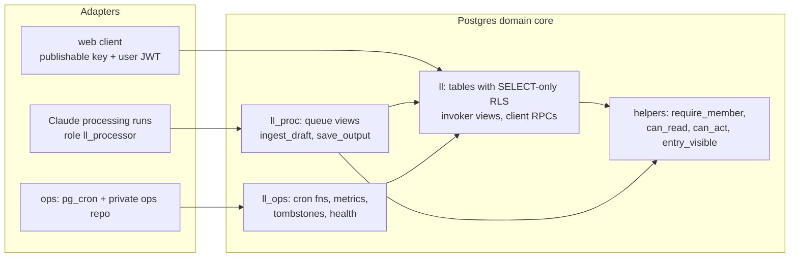
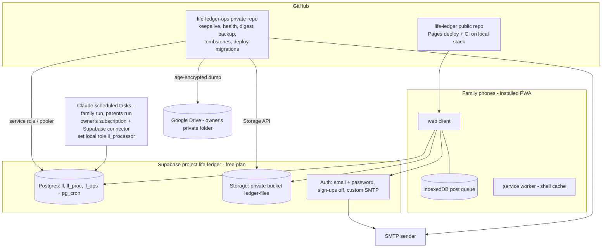
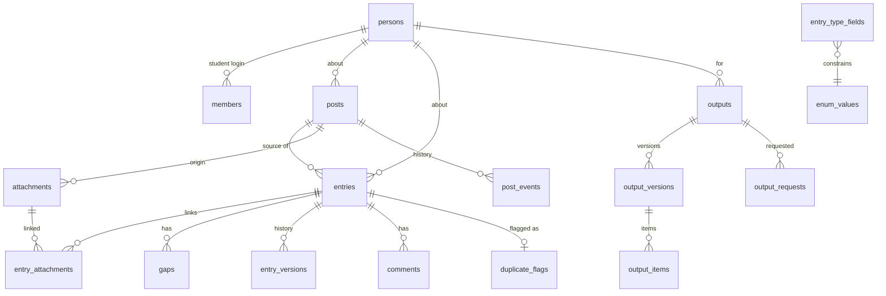

# Architecture Spine — Family Life Ledger v1

## Design Paradigm

**Thin client over a policy-enforcing database.** Postgres is the domain core: every rule about status, visibility, permissions, provenance and history is enforced inside the database by RLS, triggers and functions. Everything else is an adapter that cannot weaken those rules. Supabase/Postgres defaults are never relied on: every grant is explicit.

| Layer | Lives in | Role |
| --- | --- | --- |
| Domain core | `supabase/migrations/*.sql` — schemas `ll` (exposed), `ll_proc`, `ll_ops` (not exposed) | Tables, predicates, triggers, functions. The only place rules live. |
| Client adapter | `web/` (static, GitHub Pages) | Renders what RLS and read RPCs return; calls client RPCs; queues posts offline; signs file URLs via Storage. |
| Processor adapter | Claude scheduled tasks + processing guide (`processing/SKILL.md`) | Under role `ll_processor`: reads `ll_proc` views, writes only through `ll_proc.ingest_draft` / `ll_proc.save_output`. |
| Ops adapter | `pg_cron` (in `ll_ops`) + private repo `life-ledger-ops` (scheduled GitHub Actions) | Purge, checks, keepalive, health alerts, digest email, encrypted backup, storage object deletion. |



Dependency rule: adapters depend on the core; the core depends on nothing outside Postgres. Adapters never talk to each other except through core tables.

## Invariants & Rules

### AD-1 — Rules live only in the database [ADOPTED]

- **Binds:** all FRs; NFR-SEC-1
- **Prevents:** a rule enforced in the browser or the processing guide but bypassable through the API.
- **Rule:** Any check whose failure would leak data, mis-set status/visibility, or corrupt history is enforced in SQL. Client-side checks are UX only and always mirror a server check. The processing guide is a courtesy; processor functions are safe against an arbitrary payload.

### AD-2 — Explicit grants; writes only through RPCs

- **Binds:** every table, view and function; FR-6; NFR-SEC-1
- **Prevents:** Postgres/Supabase defaults (`EXECUTE` to `PUBLIC`, owner-rights views, auto-granted tables) opening paths no AD intended; two features mutating one table by different paths.
- **Rule:**
  1. Migration 00 runs `alter default privileges in schema ll, ll_proc, ll_ops revoke all on functions from public` and revokes default table privileges; every object is then granted explicitly. Every function is followed by `revoke all … from public, anon, authenticated` and the one grant it needs. Policy helpers (`require_member`, `is_parent`, `is_owner`, `my_person`, `can_read`, `entry_visible`, `post_visible`, `can_act`, `upload_allowed`) are granted `execute` to `authenticated`, because RLS policies run as the caller. `ll.badge_for` (digest) and `ll_ops.ops_health` (keepalive and health) are granted to `service_role` only.
  2. Tables in `ll` have RLS enabled with `SELECT` policies only; there are no client `INSERT/UPDATE/DELETE` policies. `authenticated` gets `SELECT` only on the tables listed in `rls-matrix.md` §2, never on `all tables in schema`.
  3. Every client mutation is a `security definer` function in `ll`, `set search_path = ''`, schema-qualified names, granted to `authenticated` only. `rpc-contracts.md` §4 is the exhaustive list; a new mutation adds a row there and a new function, never a write policy.
  4. Every client RPC's first statement is `perform ll.require_member()` (raises `session-expired` / `not-a-member`); the second resolves its target to an entry, post or output and calls `ll.can_act(...)` (AD-4), raising `forbidden`. No RPC reads `ll.members` directly for authorization.
  5. Read RPCs are `security invoker` unless they must aggregate across visibility or see archived rows (`get_output`, `my_badge`, `archive_list`), in which case they apply `can_read` per row.
  6. A function never returns a row the caller could not `SELECT`.
  7. `edit_entry` accepts only registry fields plus `_title`, `_dates`; any other key (`type`, `person_id`, `visibility`, `status`, `speaker`, `confirmed_*`, `archived_at`, …) is `forbidden-key`. `type`, `person_id`, `source_post_id` are immutable after insert (except via the `_person` gap, AD-9). `speaker` is set at creation and is a forbidden key for everyone except the student editing a reflection whose speaker is the student; any speaker change clears confirmation.
  8. Only the Data API exposes `ll`; `pg_graphql` is disabled and no Realtime publication includes `ll`, `ll_proc` or `ll_ops`.

  A pgTAP catalog test asserts every function ACL and every view's `security_invoker` against an allow-list (`test-plan.md`).

### AD-3 — Processor boundary

- **Binds:** FR-15, FR-16, FR-18, FR-19, FR-34, FR-35; PRD §6.2
- **Prevents:** the processing run reading or writing outside its contract; clients calling processor functions; model text from one post leaking into another.
- **Rule:**
  1. Role `ll_processor` (`nologin`, `noinherit`, no `bypassrls`) has `usage` on `ll_proc` only, `select` on `ll_proc.processing_queue`, `ll_proc.processor_context`, `ll_proc.output_request_queue`, and `execute` on `ll_proc.ingest_draft(jsonb)` and `ll_proc.save_output(jsonb)`. Nothing else.
  2. Every SQL batch the run sends is wrapped `begin; set local role ll_processor; set local ll.run_class = '<family|parents>'; …; commit;`. This is the guide's first rule, and the golden-post test checks `current_user`. The processor functions are `security definer` (so `current_user` is their owner) and therefore check `current_setting('role') = 'll_processor'`, refusing otherwise; a pgTAP test proves the check.
  3. Payloads are dollar-quoted with a random tag (`$p<random>$…$p<random>$::jsonb`), never single-quoted.
  4. Payloads are validated against the JSON schemas in `rpc-contracts.md` with `pg_jsonschema`. Keys `status`, `visibility`, `confirmed_by`, `confirmed_at`, `id`, `author_id` are rejected (`forbidden-key`), not ignored.
  5. Provenance: `title_span` is required; for text-kind fields `v` must be a substring of its span quote (normalization only for enum, number, date and bool kinds; a `url_or_file` URL must appear in the quote or the post's links); image spans are rejected in v1; required-field gap questions come from the registry, never from the model.
  6. Runs are split by visibility class. The `family` run sees only posts, entries and requests of visibility family or shareable. The `parents` run sees parents_only posts and entries, plus confirmed family entries only inside `recommender_pointers` requests (FR-40), whose output is itself parents_only. The views read the class from `ll.run_class`, so one context window never mixes classes. There are two scheduled tasks, both at 8:45 pm Eastern, family first.
  7. Errors are returned as `{ok:false, code}`, not raised, so attempt counts persist. Every processor-caused error counts; after 2 attempts the post becomes `needs_manual` (FR-16).

  **Residual risk (recorded):** the Supabase connector itself has full project access, so step 2 is guide-enforced. Mitigations: the guide rule, the golden-post test, and a connector scoped to the life-ledger project only. See D-9.

### AD-4 — One readability predicate, one action predicate

- **Binds:** FR-4 … FR-7, FR-15, FR-23, FR-24, FR-26, FR-30, FR-37, FR-42; Q1, Q2 decisions
- **Prevents:** each feature computing "who can see or do this" differently.
- **Rule:**
  1. Visibility order: `private < parents_only < family < shareable`; `ll.narrowest(a, b)` uses it.
  2. `ll.can_read(visibility, author_id)` is the only readability function. `ll.entry_visible(entry_id)` = `can_read(entry.visibility, entry.author_id)` ∧ not archived; `ll.post_visible(post_id)` likewise. Every SELECT policy, including those on child tables (gaps, comments, versions, flags, entry_attachments), uses one of these.
  3. `ll.can_act(action, entry_id)` is the only action predicate. It encodes the FR-6 matrix (`rls-matrix.md` §3) and always ANDs `entry_visible` (except `restore`, which ANDs readability of the archived row). Queues and badges filter with `can_act('answer', …)`.
  4. `entries.author_id` (not null) is the source post's author for ingested entries and the caller for manual ones. "Own" in FR-6 always means `author_id = auth.uid()`.
  5. Entry visibility at insert = `narrowest(type default, post.visibility)`. `set_visibility` on an entry narrows freely and widens only up to its post. Narrowing a post narrows all its entries in the same transaction (reason `visibility`). A student cannot choose parents_only. Fixed rules (parent_note = parents_only; score/academic never shareable) are CHECK constraints.
  6. Client-readable views are `with (security_invoker = true)`. `ll_proc` and `ll_ops` are not exposed to the Data API and have no grants to `anon` or `authenticated`.
  7. Bulk reads of a person's data (`export_person`, digest counts) return only what the requesting login can read (Owner Decision 2).

### AD-5 — Status is derived; gaps have one writer

- **Binds:** FR-16, FR-20, FR-23, FR-28; Q3 decision
- **Prevents:** features setting status by hand, or several implementations of "missing required field ⇒ one open gap".
- **Rule:** A `BEFORE INSERT OR UPDATE` trigger on `entries` calls `ll.sync_gaps(NEW)`, the only writer of required-field gaps (it opens missing ones and closes filled ones from the registry), and then sets `NEW.status`: any open required gap → `needs_detail`; else `confirmed_at` set → `confirmed`; else `draft`. Confirm RPCs set only `confirmed_at/by` and refuse while a required gap is open. A required gap re-opening clears `confirmed_at`. Gap RPCs (`answer_gap`, `mark_not_applicable`) write the gap and touch the entry once. `status_sweep` only reports drift to `ll.events`.

### AD-6 — Entry shape: common columns + typed field map + registry

- **Binds:** FR-11 … FR-14, FR-16, FR-18, FR-23; SM-5
- **Prevents:** per-type tables with diverging logic; facts stored twice; fields without provenance.
- **Rule:** Type data lives in `entries.fields jsonb` as `{ "<field>": { "v": <canonical value>, "span": <span> } }`. `ll.entry_type_fields` is the registry: `required`, `kind`, `enum_ref`, `gap_question`, `storage` (`fields` or `column:<name>`), `derived` rule, Common App mapping. Each fact lives in exactly one place: `title`, `date_start/date_end/date_precision` and `person_id` are columns, and their provenance is stored as `fields._title` and `fields._dates`. Span kinds: `text` (`start, end, quote`), `answer` (`by`, `gap_id` nullable), and `derived` (`rule`, `from`), the last only for registry-derived fields such as `grade_levels`. The `ll.check_provenance()` trigger rejects any field or common-column fact without a valid span. Canonical JSON per kind is fixed in `data-model.md`. Enums are rows in `ll.enum_values` (`activity_type` refreshable by migration).

### AD-7 — History is append-only and trigger-written

- **Binds:** FR-18, FR-21, FR-22, FR-32, FR-36; NFR-AUD-1
- **Prevents:** callers forgetting to version; noisy or duplicate versions.
- **Rule:** An `AFTER UPDATE` trigger writes one `entry_versions` row per entry per transaction (deduplicated on `txid_current()`), skips updates that change only `status` or `updated_at`, and takes `reason` from the transaction setting `ll.reason`. The reasons are exhaustively: `edit, answer, not_applicable, confirm, unconfirm, merge, visibility, archive, restore, attest, attach, detach, discard`. Post visibility changes and soft deletes write `post_events`. Output versions are immutable; edits create a new version (`origin='edit'`). The only mutation of history is purge redaction (AD-10).

### AD-8 — Identity, sessions and auth settings

- **Binds:** FR-1 … FR-3, FR-6, FR-17
- **Prevents:** conflating login and subject; strangers holding a valid session; sessions outliving the 30-day rule or a parent's sign-out.
- **Rule:**
  - `ll.members(user_id, role, person_id, display_label, sessions_revoked_at, …)` and `ll.persons(id, display_label, kind, ai_excluded, grade_9_start, graduation_year)` are separate tables.
  - The role helpers `require_member()`, `is_parent()`, `is_owner()` and `my_person()` are `security definer stable`, and policies call them as `(select ll.is_parent())`.
  - `require_member()` accepts a request only if the caller has a `members` row and the JWT's `session_id` maps to an `auth.sessions` row with `created_at > coalesce(sessions_revoked_at, '-infinity')` and `created_at > now() - interval '30 days'`. Otherwise it raises `session-expired`, and the client signs out locally.
  - `signout_student` sets `sessions_revoked_at` and makes a best-effort delete of the student's sessions.
  - Auth settings, applied from the runbook: sign-ups disabled; custom SMTP for Auth email; Site URL and redirect allow-list set to the Pages origin. The parent's client sends password resets via `resetPasswordForEmail`.
  - Real names live only in the database, never in the repo.

### AD-9 — AI exclusion is data, checked at every processor relation

- **Binds:** FR-15, FR-16, FR-17; PRD §6.1; Q2 decision
- **Prevents:** the younger child's data, private posts or unlabelled posts reaching the model.
- **Rule:**
  - `persons.ai_excluded = true` is the only privacy gate for the younger child; `kind` is for the UI only.
  - `posts.person_id` is not null.
  - All three `ll_proc` views and both processor functions exclude or refuse `ai_excluded` persons, `private` posts and entries, and rows outside the run's visibility class.
  - `create_post` refuses `ai_excluded` persons; the UI uses `create_milestone` instead.
  - Persons are presented to the model by role label ("Student"), never by `display_label`.
  - Answering a `_person` gap on an ingested entry refuses `ai_excluded` persons.
  - A student post that mentions the younger child still reaches the model in full (accepted residual; Owner Decision 1).

### AD-10 — Archive, purge and redaction

- **Binds:** FR-7, FR-22, FR-30, FR-43
- **Prevents:** purged content surviving anywhere.
- **Rule:**
  - `archived_at` hides an entry from every view and output (`entry_visible`).
  - The daily `ll_ops.purge_expired()`:
    - deletes entries archived more than 30 days ago, with their gaps, versions, comments, duplicate flags (both sides) and entry_attachments;
    - hard-deletes soft-deleted posts that have no remaining entries after 30 days;
    - for attachments left with no origin or link, deletes the row and inserts the object path into `ll_ops.object_tombstones`;
    - on every `output_items` row citing a purged entry, in every version, sets `redacted = true` and empties `payload`, `generated_payload` and the text keys in `slot`;
    - strips the purged entry's values from the merge versions of surviving entries.
  - The ops workflow deletes tombstoned objects through the Storage API.
  - A post with a non-archived confirmed entry cannot be deleted.
  - The ops workflow deletes backups older than 12 weeks.

### AD-11 — Outputs: one read path, one validator

- **Binds:** FR-7, FR-34 … FR-41
- **Prevents:** reading items around the hiding rule or the access log; edits that cite ineligible entries.
- **Rule:**
  - `authenticated` has no grant on `output_versions`, `output_items` or `output_access_log`; `outputs` can be listed (metadata only).
  - `ll.get_output(output_id, version_id)` is the only read path. It returns the items whose every cite passes `entry_visible` for the caller, plus `hidden_count`, and writes `output_access_log` for parents_only outputs in the same transaction.
  - `ll.validate_output_items(kind, person_id, items)` is shared by `save_output` and `edit_output`. It checks cite eligibility per kind (`rpc-contracts.md` §2), requires essay quotes to be exact substrings of a confirmed reflection whose speaker is the student, allows no essay prose, and flags over-limit values instead of trimming them.
  - `edit_output` carries items hidden from the editor forward unchanged.

### AD-12 — Offline post queue is client-keyed and idempotent

- **Binds:** FR-8, FR-9, FR-10; NFR-REL-1
- **Prevents:** duplicate posts; lost posts; a known id revealing another login's post.
- **Rule:**
  - The client generates the post id and attachment ids at submit.
  - Photos upload to `posts/<post_id>/<attachment_id>.<ext>` with `upsert: false`; "already exists" counts as success.
  - `ll.create_post` inserts. On an id conflict it returns the row only if `author_id = auth.uid()` and the stored content matches; otherwise it raises `id-conflict`.
  - Side effects (the `post_duration` event, `last_person_id`) happen only on an actual insert.
  - Local records are shown only to the login that wrote them, and sent records are cleared on sign-out.

  Details in `offline-queue.md`.

### AD-13 — Time and schedules

- **Binds:** FR-14, FR-22, FR-25, FR-31, FR-43; SM-4
- **Prevents:** DST bugs and two definitions of "school year".
- **Rule:**
  - `timestamptz` for instants; `date` + `date_precision` for evidence dates.
  - School-year logic exists only in `ll.grade_level(person_id, date)`, with years running Aug 1 – Jul 31 from `grade_9_start`. `grade_levels` is derived in the entries trigger unless a person answered it.
  - Every "Eastern time" job, whether `pg_cron` or an ops workflow, runs hourly (UTC) and acts only when `now() at time zone 'America/New_York'` matches.
  - Jobs are idempotent per local date, because GitHub schedules can run late.

### AD-14 — Where scheduled work runs (resolves PRD Q4)

- **Binds:** FR-22, FR-25, FR-43; SM-4, SM-5
- **Prevents:** jobs scattered across hosts; secrets in the public repo.
- **Rule:**
  - In-database work runs on `pg_cron` in `ll_ops`: `purge_expired` (daily), `nightly_accuracy_check`, `status_sweep` (report-only), and a weekly prune of `cron.job_run_details`.
  - Work that needs outside credentials runs as scheduled GitHub Actions in the **private** repo `life-ledger-ops`: digest email, backup, tombstone deletion, keepalive and health (AD-18). The service-role key, DB password, SMTP and Drive credentials are that repo's secrets.
  - Workflows never print row content and never upload artifacts.
  - Backup is a schema-only plus a data-only `pg_dump` of `ll` and `auth` through the Supavisor session pooler, plus a storage sync. It is encrypted with an `age` public key before leaving the runner; the private key exists only in the owner's password manager.
  - Digest content is `ll.badge_for(user_id)` counts and a link, nothing else.

### AD-15 — Client is a no-build static app [ADOPTED]

- **Binds:** NFR-PLAT-1, NFR-PERF-1, NFR-A11Y-1, NFR-OBS-1
- **Prevents:** a build step or module system diverging from the owner's other apps.
- **Rule:**
  - Plain HTML/CSS/JS in `web/`, published by the standard GitHub Pages deploy workflow. Branch mode can only serve root or `/docs`, and `/docs` holds specs.
  - IIFE scripts each attach one namespace to `window.LL`.
  - Vendored `supabase-js` and `fflate` under `web/js/vendor/`; every script carries a shared `?v=` release stamp.
  - The client is created with `{ db: { schema: 'll' } }`. No third-party scripts.
  - A service worker caches the app shell network-first so the post screen opens offline. This deliberately deviates from psat-sprint and is required by FR-9.
  - The app calls `navigator.storage.persist()` and tells users to post from the installed icon.

### AD-16 — Events are the only telemetry

- **Binds:** FR-10, NFR-OBS-1, SM-1 … SM-7, SM-C1 … SM-C3
- **Prevents:** metrics from different sources; clients emitting server events; third-party scripts.
- **Rule:**
  - The client logs through `ll.log_event(name, props)` with a client allow-list (`post_opened`, `post_submitted`, `queue_flushed`) and bounded numeric or enum props, never free text.
  - `post_duration` is written only by `create_post` on an actual insert (AD-12). Server jobs write server names (`accuracy_check`, `purge_run`, `digest_sent`, `backup_run`, `status_drift`, `health`) directly.
  - Metric definitions are views in `ll_ops`, read only by the ops workflow or the owner-only RPC `ll.metrics()`.

### AD-17 — Files: origin, links and storage policy

- **Binds:** FR-8, FR-16, FR-18, FR-30, FR-32; FR-4
- **Prevents:** a file from a narrower post becoming readable through a wider entry; overwriting attested forms; two shapes for attachments.
- **Rule:**
  - `attachments` has one origin (`post_id`) or is entry-native; `entry_attachments(entry_id, attachment_id)` links files to entries.
  - A link is allowed only when the entry has the same person and is no wider than the attachment's origin. `ingest_draft` may link only attachments of the post being ingested (`unknown-attachment`).
  - File readability = `post_visible(origin)` or `entry_visible` of a link.
  - Bucket `ledger-files` is private, with `file_size_limit` 25 MB and an allowed-MIME list. The RPC re-checks the 10 MB limit for images and PDFs using `storage.objects.metadata`.
  - Storage policies:
    - SELECT follows the readability rule.
    - INSERT is allowed only when `ll.upload_allowed(path)` passes. This definer function accepts a post that does not exist, or one that is the caller's and still waiting, or an entry that passes `can_act('attach')`.
    - There are **no UPDATE or DELETE policies**.
  - The client creates signed URLs (`createSignedUrl(path, 600)`).
  - Detach and delete go through `ll.detach_file`, which versions the change, clears an attestation pinned to that attachment, and tombstones orphaned objects.
  - Attestation stores `attested_attachment_id`; verified hours require that link to still exist.

### AD-18 — Operations envelope

- **Binds:** NFR-REL-1, FR-43; SM-4; free-plan limits
- **Prevents:** a paused project, silent job failures, or ad-hoc production changes.
- **Rule:**
  - **Environments:** the production project `life-ledger` (free plan) and a local `supabase start` stack for development, CI and restore tests. No hosted staging. Golden-post tests run against a temporary free project, only when the owner pauses another project for it.
  - **Deploy:**
    - Migrations reach production only via `supabase db push`, run by the owner from a workstation (DB password from the password manager) or through the manual `deploy-migrations` workflow in the ops repo.
    - Migrations ship before the client release that needs them, and clients tolerate unknown columns.
    - Migrations are add-only after the first deploy; fixes go forward.
  - **Keepalive and health:** a daily ops workflow makes an authenticated API call, which prevents the 7-day free-plan pause. It checks for:
    - HTTP 540 (project paused);
    - failed `cron.job_run_details`;
    - oldest `waiting` post older than 30 h;
    - last `backup_run` older than 8 days;
    - DB size over 400 MB;
    - storage over 800 MB.

    It emails the owner counts only, and only when a threshold is crossed.
  - **Restore:** the latest backup is restored into the local stack each quarter from a written runbook, and a Routine reminds the owner.

## Consistency Conventions

| Concern | Convention |
| --- | --- |
| Schema & naming | Schemas `ll` (exposed), `ll_proc`, `ll_ops`. Tables plural snake_case; RPCs verb_noun; predicates `is_*`, `can_*`, `*_visible`. Migrations `supabase/migrations/YYYYMMDDHHMM_<slug>.sql`, idempotent, add-only after first deploy. |
| Functions | `set search_path = ''`; all names schema-qualified; explicit revoke and grant after each. |
| IDs | `uuid`; client-generated for posts and post attachments, `gen_random_uuid()` otherwise. |
| Dates | Evidence dates are `date` + `date_precision` (`day`/`month`/`year`, stored as the first day of the period). Instants are `timestamptz`. The UI shows America/New_York. |
| Source span | `{kind:'text', start, end, quote}` (post implied by `source_post_id`) · `{kind:'answer', by, gap_id or null}` · `{kind:'derived', rule, from}`. No image spans in v1. |
| Canonical values | Per-kind JSON in `data-model.md` (e.g. `grade_levels: ["9","10"]`, `honor_level: "state_regional"`); UI labels come from `enum_values.label`. |
| RPC errors | Client RPCs raise `errcode 'P0001'`, `message = <code>`; processor functions return `{ok:false, code, detail}`. Codes listed in `rpc-contracts.md`. |
| Client state | The server is the source of truth, except the offline post queue (IndexedDB `ll-queue`). |
| Secrets | The public repo holds only the Supabase URL and publishable key. Everything else lives in the private ops repo's secrets or the owner's password manager. |
| Privacy in repo | No real names, family details, seed data or exports. Fixtures use role labels. |
| Accessibility | WCAG AA tokens in `web/css/theme.css`; 44 px targets; every control labelled for VoiceOver. |

## Stack

| Name | Version |
| --- | --- |
| Supabase (Postgres, Auth, Storage, pg_cron, pg_jsonschema) — free plan, new project | Postgres 17 |
| @supabase/supabase-js (vendored UMD build) | 2.117.2 |
| fflate (vendored, client-side export zip) | 0.8.3 |
| Supabase CLI (local stack, migrations, `supabase test db`) | 2.119.0 |
| pgTAP (via Supabase CLI) | bundled with CLI 2.119.0 |
| @playwright/test (e2e, CI only) | 1.63.0 |
| Node.js (test scripts, CI) | 24 LTS |
| age (backup encryption, ops repo) | 1.3.2 |
| GitHub Pages (hosting, Actions deploy) | managed |

## Structural Seed





Full columns, constraints and migration order are in `data-model.md`.

```text
life-ledger/
  web/                      # static client, published by the Pages deploy workflow
    index.html  sw.js  manifest.webmanifest
    css/theme.css
    js/vendor/supabase-2.117.2.js  js/vendor/fflate-0.8.3.js
    js/api.js  js/queue.js  js/router.js  js/views/*.js
  supabase/
    migrations/             # ll, ll_proc, ll_ops, RLS, RPCs, cron
    tests/                  # pgTAP: catalog_*.sql, rls_*.sql, rpc_*.sql
  processing/
    SKILL.md                # processing guide (no personal data)
  test/                     # node unit tests + Playwright e2e against the local stack
  .github/workflows/        # ci.yml, pages.yml (no secrets)
  docs/
```

## Capability → Architecture Map

| Capability / Area | Lives in | Governed by |
| --- | --- | --- |
| FR-1 sign-in, 30-day sessions | Supabase Auth, `require_member` | AD-8 |
| FR-2 roles | `members`, role helpers | AD-8, AD-4 |
| FR-3 parent controls | `signout_student`, `resetPasswordForEmail` | AD-8 |
| FR-4, FR-5 visibility, defaults | `can_read`, insert trigger, CHECKs | AD-4 |
| FR-6 action matrix | `can_act`, client RPCs | AD-4, AD-2 |
| FR-7 hidden output items | `get_output` | AD-11 |
| FR-8 … FR-10 quick post, offline, timing | `web/js/queue.js`, `create_post`, `log_event` | AD-12, AD-15, AD-16, AD-17 |
| FR-11 … FR-13 evidence model, Common App map | `entries.fields`, `entry_type_fields`, `enum_values` | AD-6 |
| FR-14 school calendar | `set_school_calendar`, `grade_level` | AD-13, AD-6 |
| FR-15, FR-16 processing queue, ingest | `ll_proc` views, `ingest_draft` | AD-3, AD-9 |
| FR-17 younger child milestones | `create_milestone` | AD-9 |
| FR-18 duplicates and merge | `ingest_draft`, `resolve_duplicate` | AD-3, AD-4, AD-5, AD-7 |
| FR-19 processing guide | `processing/SKILL.md` | AD-3 |
| FR-20 … FR-22 status, versions, archive/purge | entries triggers, `confirm_entry`, `purge_expired` | AD-5, AD-7, AD-10 |
| FR-23, FR-24 queue, badge | `my_queue`, `my_badge` | AD-4 (`can_act('answer')`) |
| FR-25 digest | ops digest workflow, `badge_for` | AD-14, AD-13 |
| FR-26 timeline | `ll.timeline` (invoker view) | AD-4, NFR-PERF-1 |
| FR-27, FR-28 brain dump, bulk confirm | `create_post`, `bulk_confirm` | AD-2, AD-5 |
| FR-29 profile | `ll.profile_summary` (invoker view) | AD-4 |
| FR-30 files | `ledger-files`, `attachments`, `entry_attachments`, `detach_file` | AD-17, AD-10 |
| FR-31 … FR-33 service hours | `ll.service_hours` (invoker view), `attest_service_form`; disclaimer copy in client | AD-17, AD-13 |
| FR-34, FR-35 save-output, requests | `save_output`, `request_output`, `output_request_queue` | AD-3, AD-11 |
| FR-36 edit and diff | `edit_output` | AD-11, AD-7 |
| FR-37 access log | `get_output` | AD-11 |
| FR-38 … FR-41 output kinds | `validate_output_items` | AD-11 |
| FR-42 person export | `export_person` (invoker) + client zip | AD-4, AD-15 |
| FR-43 weekly backup | ops backup workflow | AD-14, AD-18 |
| NFR-SEC-1 RLS tests | `supabase/tests/` | AD-2, `test-plan.md` |

## Deferred

- **D-1 Visual design and screen flows:** owned by `bmad-ux`; only theme tokens and a11y rules are fixed here.
- **D-2 Common App activity-type list** (PRD Q5): loaded as `enum_values` rows by migration before the activity stories, and refreshed each cycle by a new migration.
- **D-3 Provider choices:** the SMTP provider (used by both Auth and the digest) and the Drive auth method (service account or OAuth token) are decided in the ops-repo story. Where they run and how secrets are held is fixed by AD-8 and AD-14.
- **D-4 Output requests** (PRD Q6):
  - `request_output` returns the existing open request for `(person, kind)`.
  - `save_output` closes the request matching `request_id`, or the open one for `(person, kind)` when none is given.
  - `cancel_output_request` lets the requester cancel.
  - The remaining UX is settled in the M3 stories.
- **D-5 Comments** (PRD Q8): `comments(entry_id, author_id, body, created_at)`, readable by whoever can read the entry. Whether parents want comments hidden from the student is settled in the M1 review stories.
- **D-6 Handover at 18** (PRD Q7): a manual procedure; persons and logins are already separate (AD-8).
- **D-7 Search, pagination tuning, thumbnails:** no divergence risk.
- **D-8 Retention of backups beyond 12 weeks:** revisit after the first year.
- **D-9 Role-scoped processor connection:** if the owner gets a connector that can log in as a specific role, give `ll_processor` its own login and drop the `set local role` wrapper.

## Owner Decisions (2026-10-06)

1. **Mixed-child posts.** Accepted residual: a post about the student that mentions the younger child reaches the model in full; ingest refuses entries about her. The post screen shows a reminder when the post text names the younger child.
2. **FR-42 export scope.** Exports contain only what the requesting login can read (AD-4.7); PRD FR-42 updated.
