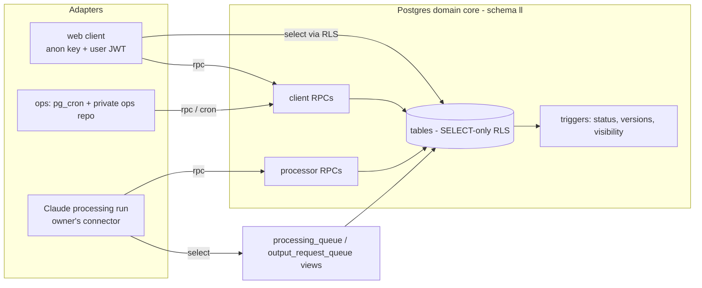
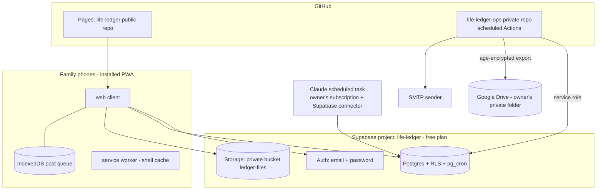
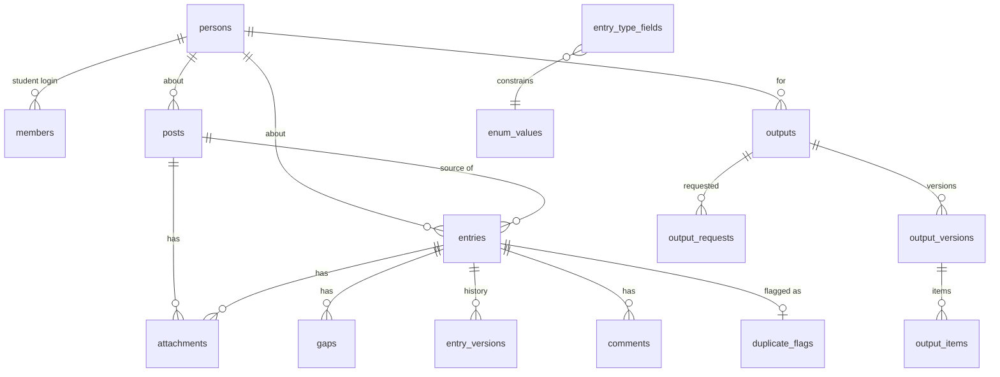

# Architecture Spine — Family Life Ledger v1

## Design Paradigm

**Thin client over a policy-enforcing database.** Postgres is the domain core: every rule about status, visibility, permissions, source spans and versioning is enforced inside the database by RLS policies, triggers and `security definer` functions. Everything else is an adapter that cannot weaken those rules.

| Layer | Lives in | Role |
| --- | --- | --- |
| Domain core | `supabase/migrations/*.sql` (schema `ll`) | Tables, RLS predicates, triggers, RPCs. The only place rules live. |
| Client adapter | `web/` (static, GitHub Pages) | Renders what RLS returns; calls client RPCs; queues posts offline. Holds no rule it relies on for safety. |
| Processor adapter | Claude scheduled task + processing guide (`processing/`) | Reads `ll.processing_queue` / `ll.output_request_queue`; writes only through `ll.ingest_draft` / `ll.save_output`. |
| Ops adapter | `pg_cron` jobs + private ops repo workflows | Purge, sweeps, checks, digest email, encrypted backup. |



Dependency rule: adapters depend on the core; the core depends on nothing outside Postgres. Adapters never talk to each other except through core tables.

## Invariants & Rules

### AD-1 — Rules live only in the database [ADOPTED]

- **Binds:** all FRs; NFR-SEC-1
- **Prevents:** a rule enforced in the browser (or in the processing guide) but bypassable through the API.
- **Rule:** Any check whose failure would leak data, mis-set status/visibility, or corrupt history is enforced in SQL. Client-side checks exist only for UX and must have a matching server check. The processing guide is a courtesy; the processor RPCs must be safe against an arbitrary payload.

### AD-2 — Writes go through RPCs; tables are read-only to clients [ADOPTED]

- **Binds:** FR-6, FR-8, FR-20 … FR-24, FR-28, FR-32, FR-35, FR-36
- **Prevents:** two features mutating the same table by different paths with different checks.
- **Rule:** Every table in schema `ll` has RLS enabled with `SELECT` policies only; there are no client `INSERT/UPDATE/DELETE` policies. Every client mutation is a `security definer` function in `ll` with `set search_path = ll, public`, that checks `auth.uid()` and role, and is granted to `authenticated` only. One RPC per user intent (`create_post`, `answer_gap`, `confirm_entry`, …), listed in `rpc-contracts.md`. New mutations add a new RPC; they never add a write policy.

### AD-3 — Processor boundary: two read views, two write functions

- **Binds:** FR-15, FR-16, FR-18, FR-19, FR-34, FR-35; PRD §6.2
- **Prevents:** the processing run writing anywhere else, or a client calling processor functions.
- **Rule:** The processor reads only `ll.processing_queue` and `ll.output_request_queue` (plus `ll.processor_context` for duplicate detection) and writes only via `ll.ingest_draft(jsonb)` and `ll.save_output(jsonb)`. These are `revoke`d from `anon` and `authenticated`; they run as the connector's privileged role and never consult `auth.uid()`. Payloads are validated against the JSON schemas in `rpc-contracts.md` inside the function. Neither function accepts `status`, `visibility`, `confirmed_by` or ids of existing rows to update — those keys are rejected, not ignored.

### AD-4 — One readability predicate

- **Binds:** FR-4, FR-5, FR-7, FR-26, FR-30, FR-37; Q1, Q2 decisions
- **Prevents:** posts, entries, files and output items each computing "who can see this" differently.
- **Rule:** `ll.can_read(visibility, author_id, person_id)` is the single readability function. Every SELECT policy on posts, entries, gaps, entry_versions, attachments, output items, and the storage bucket policy calls it (directly or via the owning row). Effective entry visibility is set at insert as `ll.narrowest(type_default, post.visibility)` and can only change through `ll.set_visibility`, which may narrow freely and widen only to ≤ the post's visibility. Fixed rules (parent_note = parents_only; score/academic never shareable) are CHECK constraints.

### AD-5 — Status is derived, never assigned

- **Binds:** FR-16, FR-20, FR-23, FR-28; Q3 decision
- **Prevents:** a feature setting `needs_detail`/`draft` by hand and drifting from the gap state.
- **Rule:** `entries.status` is written only by the trigger function `ll.recompute_status()`, which runs after any change to an entry's fields or gaps. Logic: any open required gap → `needs_detail`; else if `confirmed_at` is set → `confirmed`; else → `draft`. The confirm RPCs (`confirm_entry`, `bulk_confirm`) set only `confirmed_at`/`confirmed_by`, and refuse while a required gap is open. A required gap re-opening on a confirmed entry yields `needs_detail` and clears `confirmed_at`.

### AD-6 — Entry shape: common columns + typed field map + registry

- **Binds:** FR-11 … FR-14, FR-16, FR-18, FR-23
- **Prevents:** per-type tables with diverging gap and merge logic; fields without provenance.
- **Rule:** `entries` holds the common columns; type-specific data lives in `entries.fields jsonb` as `{ "<field>": { "v": <value>, "span": <source span>, "by": <login uuid or null> } }`. `ll.entry_type_fields(type, field, required, kind, enum_ref)` is the registry; gap creation, validation, merge and Common App mapping all read it. A field without `span` (extracted) or `by` (answered) is rejected by a CHECK trigger. Enums (activity_type, timing, level, kind, role) are rows in `ll.enum_values`, not Postgres enums, so the Common App list can be refreshed by migration without a type change.

### AD-7 — History is append-only and trigger-written

- **Binds:** FR-18, FR-21, FR-22, FR-32, FR-36; NFR-AUD-1
- **Prevents:** callers forgetting to version, or versions disagreeing with the row.
- **Rule:** An `AFTER UPDATE` trigger on `entries` writes `entry_versions(entry_id, editor, at, before, after, reason)`; `reason` comes from the transaction-local setting `ll.reason` that each RPC sets (`edit`, `confirm`, `merge`, `answer`, `attest`, `archive`). No code inserts into `entry_versions` directly. Output versions are immutable rows; an edit creates a new `output_versions` row with `parent_id` and `origin='edit'`. The only mutation of history is purge redaction (AD-10).

### AD-8 — Identity: logins, roles and persons are separate

- **Binds:** FR-1 … FR-3, FR-6, FR-17
- **Prevents:** conflating "who is signed in" with "who the evidence is about".
- **Rule:** `ll.members(user_id → auth.users, role in ('parent_admin','student_owner'), person_id null)`; `ll.persons(id, display_label, kind in ('student','child'), ai_excluded, grade_9_start, graduation_year)`. The student's member row points to his person. `ll.is_parent()` and `ll.my_person()` are the only role helpers; both (and `can_read`) return false for a JWT issued before `members.sessions_revoked_at`, which is how `signout_student` takes effect on the next request. No sign-up: accounts are created by the owner in the Supabase dashboard plus one `members` row. Real names live only in the database, never in the repo or seed files.

### AD-9 — AI exclusion is a data flag checked twice

- **Binds:** FR-15, FR-16, FR-17; PRD §6.1; Q2 decision
- **Prevents:** the younger child's or a private post reaching the model by a new query path.
- **Rule:** `persons.ai_excluded = true` for the younger child. `ll.processing_queue` excludes posts whose person is `ai_excluded` or whose visibility is `private`, and `ll.ingest_draft` re-checks both and raises. `ll.processor_context` (the view used for duplicate detection) applies the same filter. The processor must never be given a broader view.

### AD-10 — Archive, purge and redaction

- **Binds:** FR-22, FR-7, FR-30
- **Prevents:** purged content surviving in outputs, versions, or storage.
- **Rule:** `archived_at` set → hidden by every SELECT policy except the archive list. A daily `pg_cron` job calls `ll.purge_expired()`: deletes entries archived > 30 days with their versions and gaps, deletes storage objects attached only to them, and sets `redacted = true, text = null` on every `output_items` row citing them in every version. A post with a non-archived confirmed entry cannot be deleted (FK + check in `ll.delete_post`).

### AD-11 — Output items cite entries; hiding is computed at read time

- **Binds:** FR-7, FR-34 … FR-41
- **Prevents:** stale copies of visibility baked into outputs.
- **Rule:** `output_items(version_id, position, slot, payload jsonb, cites uuid[], redacted)`. Clients read outputs only through `ll.get_output(output_id, version_id default latest)`, which returns items whose every cited entry passes `can_read` for the caller, plus `hidden_count`. `save_output` rejects items citing entries that are not confirmed, archived, private, or (for kinds other than `recommender_pointers`) `parents_only`; `essay_angles` rejects parent_note cites; quotes in `essay_angles` must equal the confirmed text of a reflection with speaker = the student.

### AD-12 — Offline post queue is client-keyed and idempotent

- **Binds:** FR-8, FR-9, FR-10; NFR-REL-1
- **Prevents:** duplicate posts on retry; lost posts.
- **Rule:** The client generates the post UUID before saving locally. `ll.create_post(id, …)` is `insert … on conflict (id) do nothing` and returns the row either way. Photos are uploaded to storage under the same post id before the RPC is called; the RPC accepts only object paths under `posts/<post_id>/`. Queue mechanics are in `offline-queue.md`.

### AD-13 — Time and schedules

- **Binds:** FR-14, FR-22, FR-25, FR-31, FR-43; SM-4
- **Prevents:** DST bugs and two definitions of "school year".
- **Rule:** Store `timestamptz` (UTC) for instants; `date` + `date_precision` for evidence dates. School-year/grade logic exists only in `ll.grade_level(person_id, date)` (Aug 1 – Jul 31, from `grade_9_start`). Anything scheduled "at Eastern time" is an hourly job that checks `now() at time zone 'America/New_York'` before acting.

### AD-14 — Scheduled operations (resolves PRD Q4)

- **Binds:** FR-22, FR-25, FR-43; SM-5; NFR-REL-1
- **Prevents:** jobs scattered across hosts with secrets in a public repo.
- **Rule:** In-database jobs run on `pg_cron`: `purge_expired` (daily), `nightly_accuracy_check` (writes to `ll.events`), `status_sweep` (safety net for AD-5). Jobs that need outside credentials — the Sunday digest email and the weekly encrypted backup — run as scheduled GitHub Actions in a **separate private repository** (`life-ledger-ops`) using the service-role key and SMTP/Drive credentials as that repo's secrets. Backups are encrypted with an `age` public key before leaving the runner; the private key exists only in the owner's password manager. Workflows never print row content and never upload artifacts. `[ASSUMPTION: owner accepts a private ops repo and SMTP sender; see Deferred D-3.]`

### AD-15 — Client is a no-build static app [ADOPTED]

- **Binds:** NFR-PLAT-1, NFR-PERF-1, NFR-A11Y-1, NFR-OBS-1
- **Prevents:** mixed module systems or a build step diverging from the owner's other apps.
- **Rule:** Plain HTML/CSS/JS in `web/`, published to GitHub Pages by the standard Pages deploy workflow (no secrets, no build step beyond copying `web/`). Each script is an IIFE that attaches one namespace to `window.LL` (`LL.api`, `LL.queue`, `LL.views.*`). Vendored `supabase-js` under `web/js/vendor/`; every script tag carries a shared `?v=` release stamp. No third-party scripts, fonts from Google Fonts only if self-hosted. A service worker caches the app shell network-first so the post screen opens offline (deliberate deviation from psat-sprint, which does not cache).

### AD-16 — Events are the only telemetry

- **Binds:** FR-10, NFR-OBS-1, SM-1 … SM-7
- **Prevents:** metrics computed from different sources or third-party scripts creeping in.
- **Rule:** The client logs via `ll.log_event(name, props jsonb)` (allow-listed names). Server jobs insert into `ll.events` directly. Metric queries live as SQL views `ll.metric_*`; nothing else defines a metric.

## Consistency Conventions

| Concern | Convention |
| --- | --- |
| Schema & naming | All app objects in schema `ll`. Tables plural snake_case; RPCs verb_noun snake_case; helper predicates `is_*`, `can_*`. Migrations `supabase/migrations/YYYYMMDDHHMM_<slug>.sql`, idempotent (`if not exists`, `drop policy if exists`), add-only after first deploy. |
| IDs | `uuid` everywhere; client-generated for posts, server `gen_random_uuid()` otherwise. |
| Dates | Evidence dates `date` + `date_precision` (`day`/`month`/`year`, stored as first day of period). Instants `timestamptz`. UI shows America/New_York. |
| Source span | `{ "kind": "text", "post_id", "start", "end", "quote" }` or `{ "kind": "image", "file_id", "region": [x,y,w,h] }` or `{ "kind": "answer", "gap_id" }` (with `by`). |
| RPC errors | `raise exception using errcode = 'P0001', message = '<code>', detail = '<human text>'`; codes are kebab-case and listed in `rpc-contracts.md`. Client maps codes to copy. |
| RPC transactions | Each RPC sets `ll.reason` locally, does its work, and lets triggers derive status and versions (AD-5, AD-7). |
| Client state | Server is the source of truth except the offline post queue (IndexedDB `ll-queue`). No other local caching of entries. |
| Secrets | Repo holds only the Supabase URL and publishable key. Service-role key, SMTP and Drive credentials only in the private ops repo's secrets. |
| Privacy in repo | No real names, family details, seed data or exports. Test fixtures use role labels ("Parent A", "Student", "Younger child"). |
| Accessibility | WCAG AA tokens in `web/css/theme.css`; 44 px targets; every control labelled for VoiceOver. |

## Stack

| Name | Version |
| --- | --- |
| Supabase (Postgres, Auth, Storage, pg_cron) — free plan, new project | managed (Postgres 17 line) `[ASSUMPTION: confirm on project creation]` |
| @supabase/supabase-js (vendored UMD build) | 2.117.2 |
| Supabase CLI (local stack, migrations, `supabase test db`) | 2.119.0 |
| pgTAP (via Supabase CLI) | bundled with CLI |
| @playwright/test (e2e, CI only) | 1.63.0 |
| Node.js (test scripts, CI) | 22 LTS |
| age (backup encryption, ops repo) | 1.2.x `[ASSUMPTION: pin at ops-repo setup]` |
| GitHub Pages (hosting) | managed |

## Structural Seed





Full columns, constraints and migration order: `data-model.md`.

```text
life-ledger/
  web/                      # static client, deployed to GitHub Pages by the official Pages Actions workflow (docs/ stays specs)
    index.html
    sw.js                   # shell cache, network-first
    manifest.webmanifest
    css/theme.css
    js/vendor/supabase-2.117.2.js
    js/api.js  js/queue.js  js/router.js  js/views/*.js
  supabase/
    migrations/             # schema ll, RLS, RPCs, cron
    tests/                  # pgTAP: rls_*.sql, rpc_*.sql
  processing/
    SKILL.md                # processing guide (no personal data)
  test/                     # node unit tests + Playwright e2e with fake Supabase
  docs/
```

## Capability → Architecture Map

| Capability / Area | Lives in | Governed by |
| --- | --- | --- |
| FR-1 … FR-3 auth, roles, parent controls | Supabase Auth, `ll.members`, `ll.signout_student` | AD-8, AD-2 |
| FR-4 … FR-7 visibility, action matrix | RLS predicates, set_visibility | AD-4, AD-2, AD-11 |
| FR-8 … FR-10 quick post, offline, timing | `web/js/queue.js`, `ll.create_post`, `ll.log_event` | AD-12, AD-15, AD-16 |
| FR-11 … FR-14 evidence model, calendar | `entries.fields`, `entry_type_fields`, `ll.grade_level` | AD-6, AD-13 |
| FR-15 … FR-19 processing contract, duplicates | views + `ll.ingest_draft`, `processing/SKILL.md` | AD-3, AD-9, AD-6 |
| FR-20 … FR-22 status, versions, archive/purge | triggers, `confirm_entry`, `purge_expired` | AD-5, AD-7, AD-10 |
| FR-23 … FR-25 queue, badge, digest | `ll.my_queue`, `ll.my_badge`, ops digest workflow | AD-2, AD-14 |
| FR-26, FR-29 timeline, profile | `ll.timeline` view, client views | AD-4, NFR-PERF-1 |
| FR-27, FR-28 brain dump, bulk confirm | `create_post` (8,000-char check), `ll.bulk_confirm` | AD-2, AD-5 |
| FR-30 files | bucket `ledger-files`, `attachments`, storage policy | AD-4, AD-10 |
| FR-31 … FR-33 service hours | `ll.service_hours` view, `ll.attest_service_form` | AD-2, AD-13 |
| FR-34 … FR-41 outputs | `output_*` tables, `save_output`, `get_output`, `request_output` | AD-3, AD-11, AD-7 |
| FR-42, FR-43 export, backup | `ll.export_person` RPC; ops backup workflow | AD-14 |
| NFR-SEC-1 RLS tests | `supabase/tests/*.sql` | `test-plan.md`, `rls-matrix.md` |

## Deferred

- **D-1 Visual design and screen flows** — owned by `bmad-ux`; only the token file and a11y rules are fixed here.
- **D-2 Exact Common App activity-type list** (PRD Q5) — loaded as `enum_values` rows by a migration before the activity stories; refresh per cycle by a new migration.
- **D-3 Ops repo provisioning** (SMTP provider, Drive auth method: service account vs. OAuth token) — decided at the backup/digest story; AD-14 fixes only where it runs and how secrets are held.
- **D-4 Output-request de-duplication** (PRD Q6) — default: one open request per (person, kind); later requests attach to it. Settle in M3 stories.
- **D-5 Comments shape** (PRD Q8) — default: `comments(entry_id, author, text, at)`, readable by whoever can read the entry. Settle in M1 review stories.
- **D-6 Handover at 18** (PRD Q7) — manual procedure; no schema impact because persons and logins are already separate (AD-8).
- **D-7 Search, pagination tuning, image thumbnails** — no divergence risk; decided in implementation.
- **D-8 Environments** — one production Supabase project plus local `supabase start` for development and CI; no staging project (free-plan slot limit).
