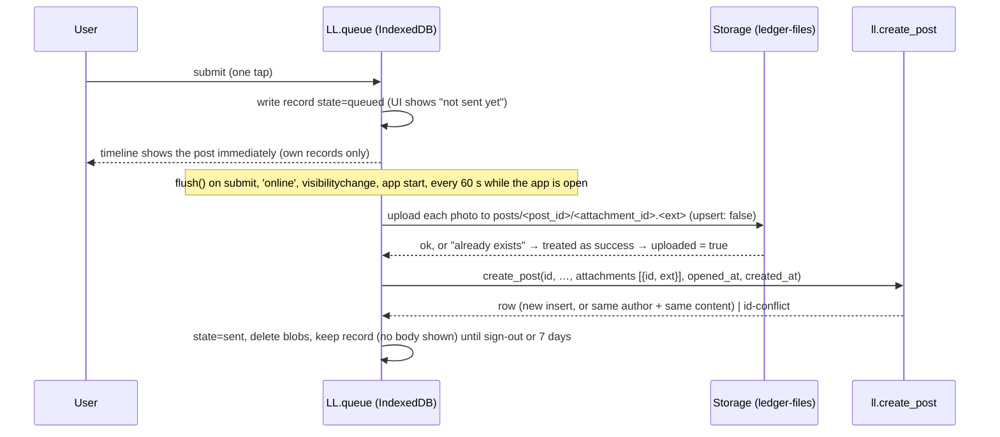

# Offline Post Queue — Family Life Ledger v1

Companion to `ARCHITECTURE-SPINE.md` (AD-12, AD-15, AD-17). Satisfies FR-8, FR-9, FR-10 and NFR-REL-1: a post is never lost and never sent twice, and a queued post is never shown to another login.

## Pieces

| Piece | Where | Job |
|---|---|---|
| App-shell cache | `web/sw.js` | Caches `index.html`, CSS, JS, icons, vendored supabase-js and fflate. Network-first with cache fallback, so new releases load at once online and the post screen still opens offline. Never caches API or storage responses. |
| Queue store | IndexedDB database `ll-queue`, object stores `posts` and `blobs` | Survives reloads and app restarts. |
| Queue module | `web/js/queue.js` (`LL.queue`) | enqueue, flush, status, sign-out cleanup. |

## Record shape

```json
{
  "id": "uuid (client-generated, = posts.id)",
  "user_id": "uuid of the signed-in login that wrote it",
  "person_id": "uuid",
  "kind": "quick | brain_dump",
  "body": "text",
  "links": ["https://…"],
  "visibility": "family",
  "attachments": [{ "blob_key": "uuid", "attachment_id": "uuid", "ext": "jpg", "mime": "image/jpeg", "uploaded": false }],
  "opened_at": "ISO time the post screen opened",
  "created_at": "ISO time of submit",
  "state": "queued | sending | sent | failed",
  "tries": 0,
  "last_error": null
}
```

## Flow



## Rules

1. **Submit is local-first.** Submit always writes to IndexedDB first, then tries to flush. The one-tap requirement (FR-8) does not wait on the network.
2. **Idempotency.** `id` and every `attachment_id` are generated once at submit and never regenerated. Uploads use `upsert: false` at the deterministic path `posts/<post_id>/<attachment_id>.<ext>`; a "resource already exists" response counts as success (there are no UPDATE/DELETE storage policies, AD-17). `create_post` returns the stored row on a repeat with the same author and content. A retry after a lost response is therefore harmless.
3. **Upload window.** The storage INSERT policy (`ll.upload_allowed`) accepts the post path only while the post does not exist, or is the caller's and still `waiting`. The queue therefore uploads every photo before calling `create_post`.
4. **Ordering.** Records flush oldest first, one at a time, to keep the timeline order the user saw.
5. **Retry.** Network errors, 5xx and HTTP 540 (project paused): exponential backoff 5 s → 5 min, unlimited tries while queued. `session-expired` or `not-a-member`: sign out locally, pause, and show "Sign in to send N posts"; resume after sign-in by the same login. Any other error code (`over-limit`, `forbidden-visibility`, `ai-excluded`, `file-missing`, …): state `failed`, shown with the code's copy and an Edit/Retry action — never dropped silently.
6. **`id-conflict`.** The id exists with another author or different content (should not happen for an untouched record). State `failed` with "This post could not be sent as-is"; the user can copy the text or choose "Send as new post", which generates a new post id and new attachment ids and re-uploads.
7. **Owner of the record.** A record is flushed and displayed only when `record.user_id` equals the signed-in login. Records of another login are never rendered (no body, no photos); the sign-in screen only says "2 posts from another account are waiting on this device". This mirrors psat-sprint's rule that one person's data is never uploaded under another account.
8. **Sign-out.** Sign-out deletes the login's `sent` records. If queued records remain, it warns and offers "Send first" or "Keep on this device"; kept records stay invisible to every other login (rule 7).
9. **Limits.** At most 4 photos per post (FR-8); images resized on device to ≤ 2,048 px long edge before queuing to stay under 10 MB and the 1 GB free storage. Brain dumps over 8,000 characters cannot be queued (FR-27).
10. **Timing.** `opened_at` and `created_at` travel with the record; `create_post` writes `post_duration` (FR-10, SM-3) only on the actual insert, so retries never double-count.
11. **Storage quota.** If an IndexedDB write fails (quota or private mode), submit falls back to an immediate online send and tells the user it could not be saved offline.

## Durability on iPhone (iOS Safari)

- After the first sign-in the app calls `navigator.storage.persist()` and logs the `persisted()` result as a bounded enum prop on `post_opened`.
- Background Sync is **not** used (unsupported on iOS). Queued posts send only while the app is open; the "not sent yet" badge stays visible on the home screen, and a record unsent for more than 24 h shows a warning.
- WebKit may evict script-written storage after 7 days without use. Installed home-screen apps keep their own counter and are granted persistence more readily, and their storage is **separate** from a Safari tab on the same origin. The app therefore tells users to post from the installed icon; a post queued in a Safari tab is invisible to the installed app.

## Tests

Covered in `test-plan.md` §3 (Playwright against the local stack, offline emulation): submit offline → reload → online → exactly one post server-side with all photos; kill mid-upload → one post (repeat upload "already exists" accepted); second login on the same device neither sees nor flushes the first login's records; sign-out clears sent records; `id-conflict` shows the recovery action.
