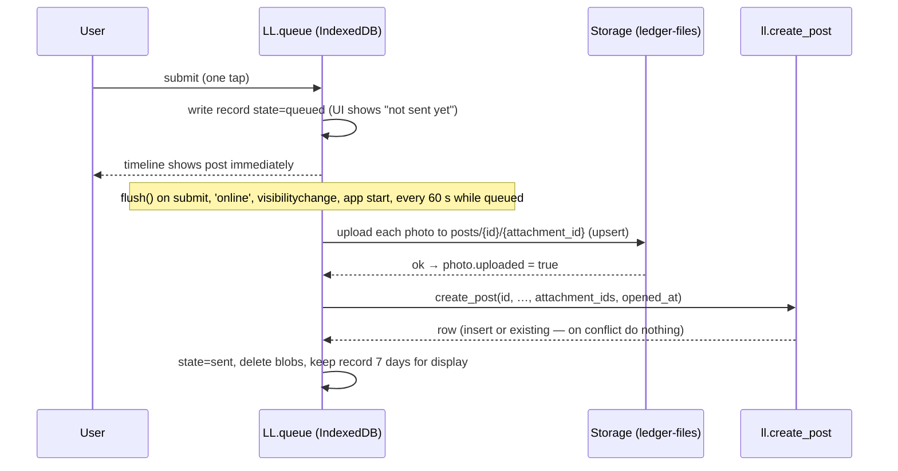

# Offline Post Queue — Family Life Ledger v1

Companion to `ARCHITECTURE-SPINE.md` (AD-12, AD-15). Satisfies FR-8, FR-9, FR-10 and NFR-REL-1: a post is never lost and never sent twice.

## Pieces

| Piece | Where | Job |
|---|---|---|
| App-shell cache | `web/sw.js` | Caches `index.html`, CSS, JS, icons, vendored supabase-js. Network-first with cache fallback, so new releases load at once online and the post screen still opens offline. Never caches API or storage responses. |
| Queue store | IndexedDB database `ll-queue`, object stores `posts` and `blobs` | Survives reloads and app restarts. |
| Queue module | `web/js/queue.js` (`LL.queue`) | enqueue, flush, status. |

## Record shape

```json
{
  "id": "uuid (client-generated, = posts.id)",
  "user_id": "uuid of the signed-in login that wrote it",
  "person_id": "uuid",
  "kind": "quick | brain_dump",
  "body": "text",
  "links": ["https://…"],
  "visibility": "family",
  "photos": [{ "blob_key": "uuid", "attachment_id": "uuid", "mime": "image/jpeg", "uploaded": false }],
  "opened_at": "ISO time the post screen opened",
  "created_at": "ISO time of submit",
  "state": "queued | sending | sent | failed",
  "tries": 0,
  "last_error": null
}
```

## Flow



## Rules

1. **Submit is local-first.** Submit always writes to IndexedDB first, then tries to flush. The one-tap requirement (FR-8) does not wait on the network.
2. **Idempotency.** `id` and every `attachment_id` are generated once at submit and never regenerated. Storage uploads use `upsert: true` at a deterministic path; `create_post` ignores a repeat id. A retry after a lost response is therefore harmless.
3. **Ordering.** Records flush oldest first, one at a time, to keep the timeline order the user saw.
4. **Retry.** Network or 5xx errors: exponential backoff 5 s → 5 min, unlimited tries while queued. Auth expired: pause and show "Sign in to send N posts"; resume after sign-in. 4xx with an error code (e.g. `over-limit`, `forbidden`): state `failed`, shown with the code's copy and an Edit/Retry action — never dropped silently.
5. **Owner of the record.** A record is only flushed by the same `user_id`. If a different login signs in on the device, queued records of the previous login stay put and are flagged on the sign-in screen ("2 posts from another account are waiting"), mirroring psat-sprint's rule that one student's data is never uploaded under another account.
6. **Sign-out.** Sign-out warns if the queue is non-empty and offers "Send first" or "Keep on this device".
7. **Limits.** At most 4 photos per post (FR-8); images resized on device to ≤ 2,048 px long edge before queuing to stay under 10 MB and the 1 GB free storage. Brain dumps over 8,000 characters cannot be queued (FR-27).
8. **Timing.** `opened_at` and `created_at` travel with the record, so `post_duration` (FR-10, SM-3) is measured on the device even when the post is sent later.
9. **Storage quota.** If IndexedDB write fails (quota/private mode), submit falls back to an immediate online send and tells the user it could not be saved offline.

## Tests

Covered in `test-plan.md` §3 (Playwright, offline emulation): submit offline → reload → online → exactly one post server-side with all photos; kill mid-upload → one post; second login on same device does not flush the first login's records.
